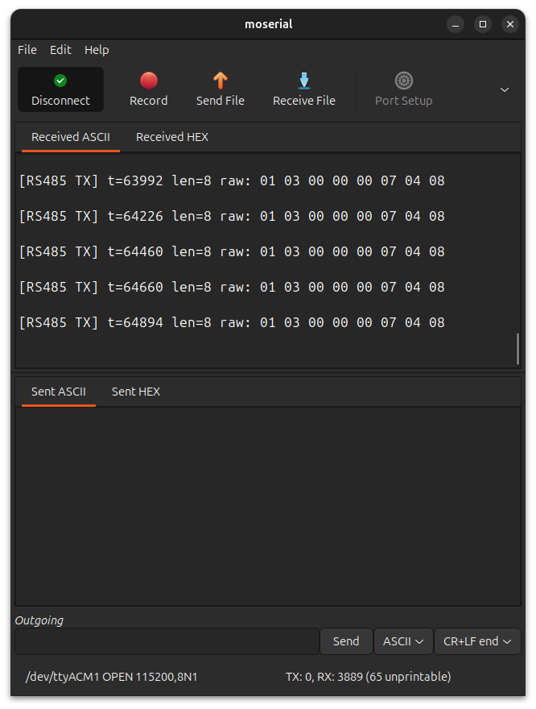
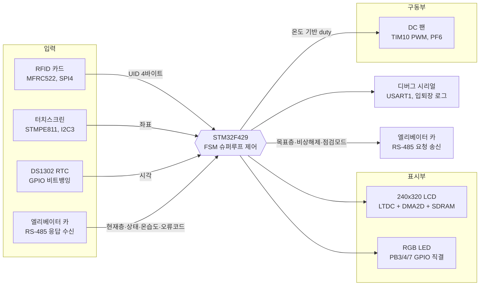
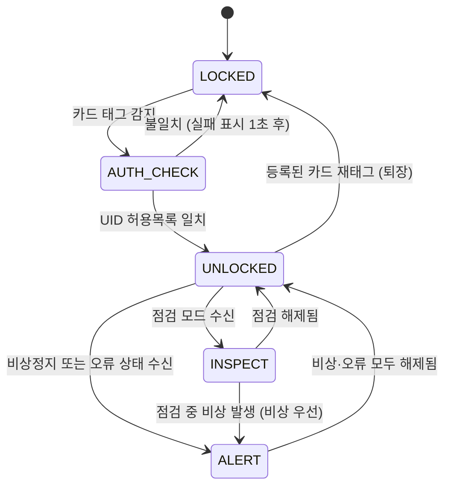
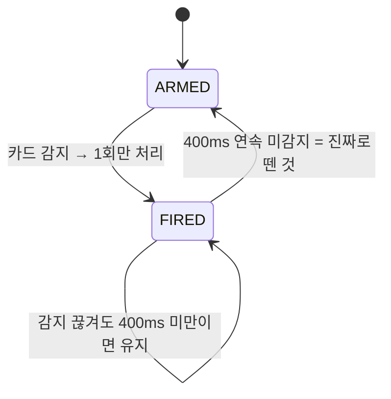
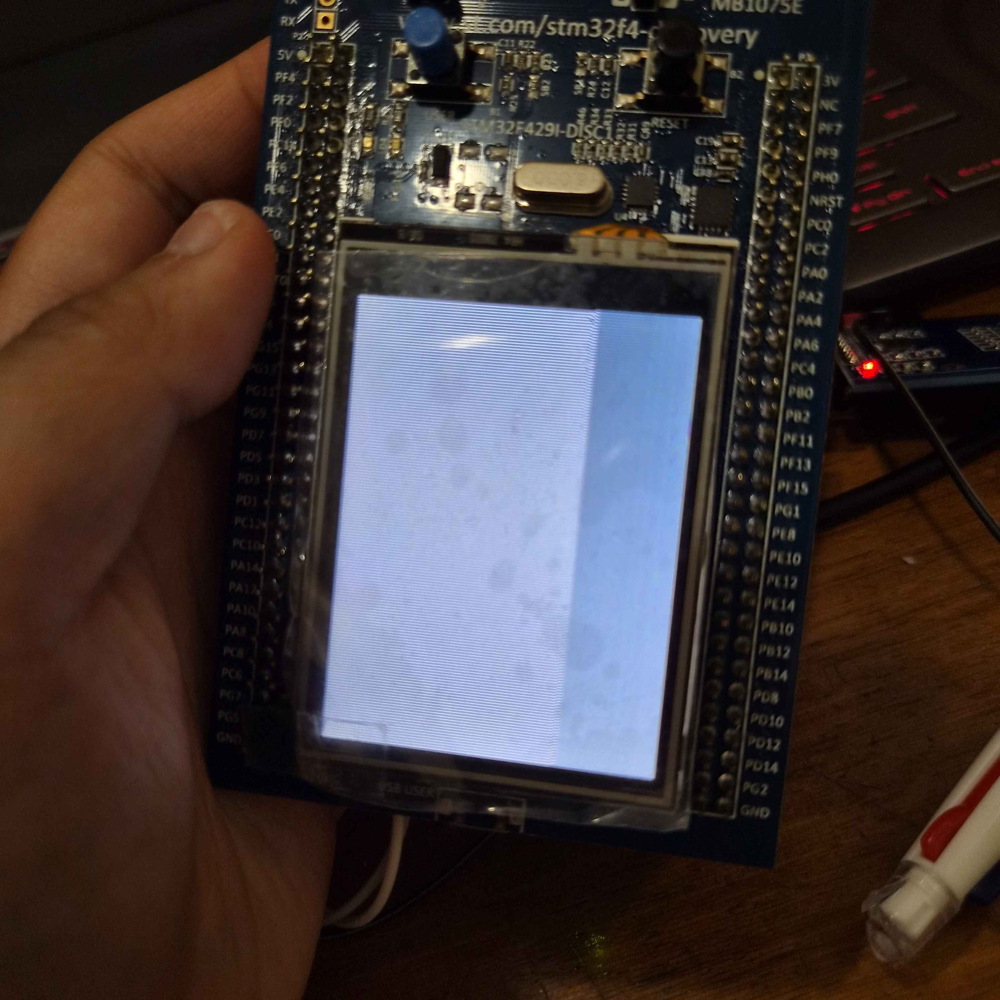
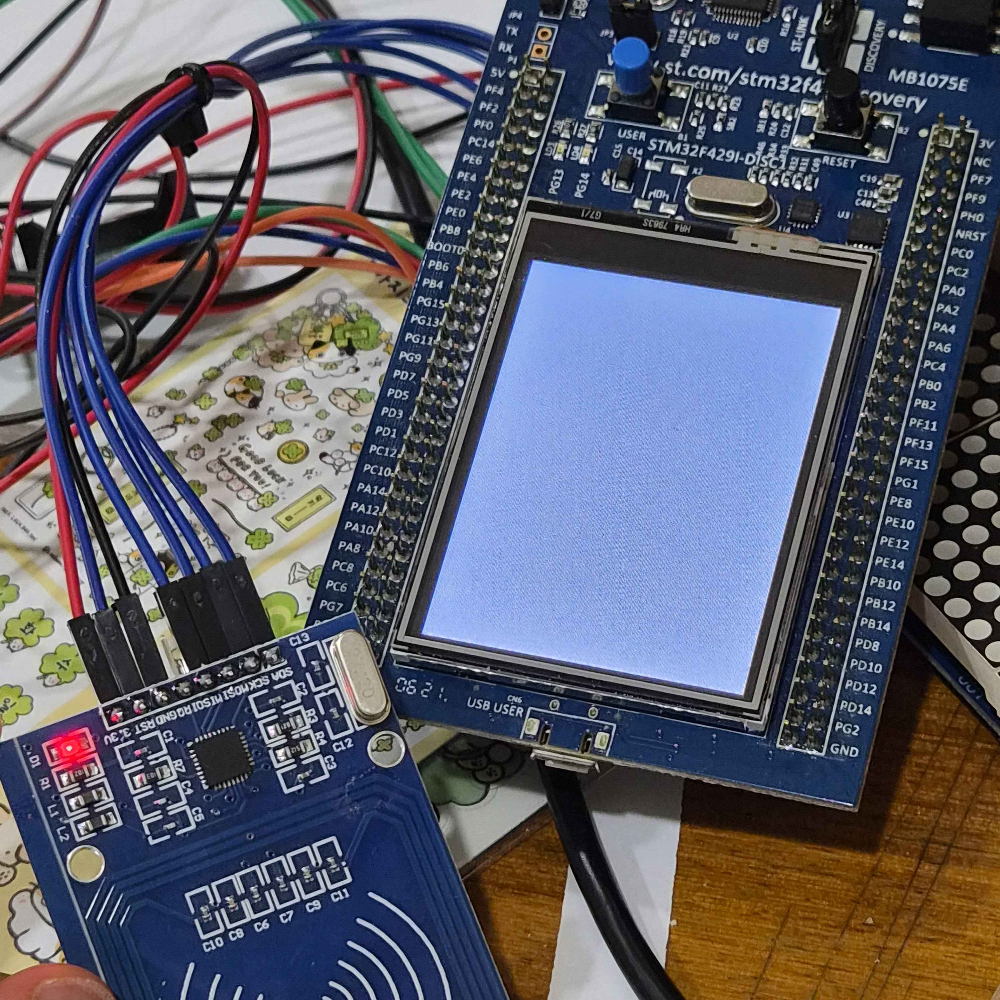
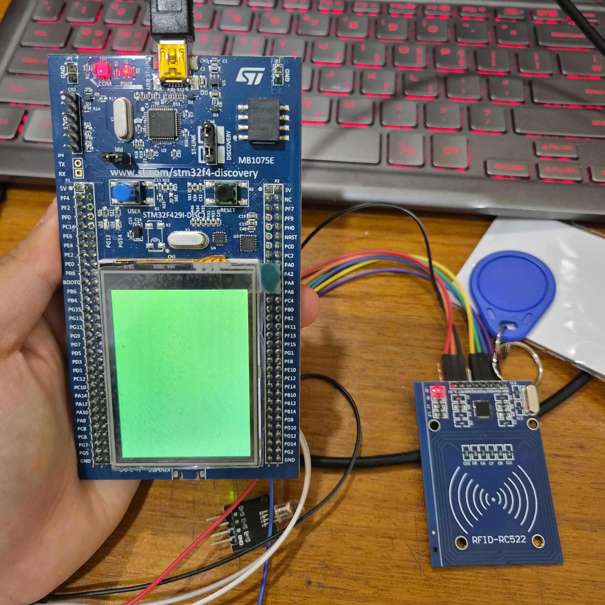

<div align="center">

# 🖥️ STM32F429 관제실 : RS-485 기반 분산형 제어 시스템

### RS-485-Based Distributed Control — Control Room HMI (Solo Project)

<br>


<br>


</div>
<br>

<!-- 사진/시연 영상 추후 첨부 예정 -->
<p align="center">
  
</p>

<br>

<p align="center">    &nbsp;  </p><p align="center"><i>관제실 보드 실물 (좌) · 터치 대시보드 화면 (우)</i></p>

<br>

3층 엘리베이터 카를 원격에서 감시·제어하는 **STM32F429 기반 관제실 HMI 시스템**입니다. **RFID 카드 인증**으로 관리자만 대시보드에 접근할 수 있고, **240×320 터치 LCD**에 현재층·목표층·운행상태·온습도·통신상태·시각을 한글로 실시간 표시합니다. **RS-485(Modbus RTU) 마스터**로서 엘리베이터 카(F411, 슬레이브)를 주기적으로 폴링하며, 터치 버튼으로 목표층 지정·비상 해제·점검 모드 전환을 원격 지시하고, 카에서 읽어온 온도에 따라 **DC 팬을 PWM으로 자동 제어**합니다.

> 이 저장소는 2보드 분산 제어 시스템 중 **관제실(F429, 마스터)** 쪽입니다.
> 짝이 되는 엘리베이터 카(F411, 슬레이브)는 별도 저장소 `Project02_Elevator`에 있습니다.

<br>

## 0. 목차

1. [시연](#1-시연)
2. [핵심 기술 요약](#2-핵심-기술-요약)
3. [프로젝트 개요](#3-프로젝트-개요)
4. [주요 기능](#4-주요-기능)
5. [화면 구성](#5-화면-구성)
6. [RS-485 통신 상세](#6-rs-485-통신-상세)
7. [시스템 구성](#7-시스템-구성)
8. [아키텍처](#8-아키텍처)
9. [핀맵](#9-핀맵)
10. [상태 전이](#10-상태-전이)
11. [실행 구조](#11-실행-구조)
12. [설계 포인트](#12-설계-포인트)
13. [Troubleshooting](#13-troubleshooting)
14. [빌드](#14-빌드)

<br>

## 1. 시연

<!-- 시연 GIF·영상은 추후 첨부 예정 -->

등록된 RFID 카드를 태그하면 잠금화면이 풀리고 대시보드가 열립니다. 화면 아래 층 버튼(1~3층)을 누르면 RS-485로 엘리베이터에 목표층이 전달되고, 카가 이동하는 모습이 대시보드에 실시간 반영됩니다. 카에 비상정지·오류가 발생하면 자동으로 경고 팝업이 뜨고, 팝업의 해제 버튼으로 원격 잠금 해제가 가능합니다. 대시보드에서 카드를 다시 태그하면 퇴장 로그를 남기고 잠금화면으로 돌아갑니다.

▶ **전체 시연 영상** : 추후 링크 첨부 예정 — 카드 인증/실패, 터치로 층 지정, 비상 팝업·해제, 점검 모드 전환, 온도에 따른 팬 가변 구동

<br>

## 2. 핵심 기술 요약

| 분류 | 핵심 기술 |
|---|---|
| **MCU** | STM32F429ZIT6 (STM32F429I-DISC1), STM32Cube HAL 기반 |
| **FSM** | 5-state 논블로킹 상태머신 (LOCKED / AUTH_CHECK / UNLOCKED / ALERT / INSPECT) |
| **통신** | RS-485 반이중, Modbus RTU **마스터** 직접 구현 (CRC16, 폴링 상태머신, 쓰기 예약 큐) |
| **그래픽** | LTDC + DMA2D + 외부 SDRAM 프레임버퍼, 240×320 RGB565 |
| **한글 표시** | Noto Sans CJK KR을 Python(Pillow)으로 **비트맵 글리프 배열로 변환**하는 자체 파이프라인 — 폰트 엔진 없이 고정 문구를 한글로 출력 |
| **터치 UI** | STMPE811 터치 컨트롤러 폴링, 에지 검출 + Y축 반전 보정, 사각형 히트 판정 |
| **RFID 인증** | MFRC522(SPI) REQA/Anticollision 직접 구현, BCC 검증, UID 허용목록 대조 |
| **RTC** | DS1302 GPIO 비트뱅잉 (양방향 1선 데이터, BCD 변환) |
| **팬 제어** | 온도 구간표 + 히스테리시스 래치 + 정지마찰 극복용 킥스타트, TIM10 PWM |
| **구조** | 논블로킹 슈퍼루프, 3계층 아키텍처(App/BSP/Core), STM32CubeIDE 빌드 |

<br>

## 3. 프로젝트 개요

**기간** : 2026.07.12 ~ 2026.08.14 | **인원** : 개인 프로젝트

### 3-1. 프로젝트 일정

| 일정 | 단계 |
|---|---|
| 07.12 | LCD 표시 복구 (LTDC 픽셀 클럭·폰트 데이터·빌드 등록 3중 문제 해결), I2C3 터치 초기화 충돌 해결, DS1302 배선 진단, RC522 카드 태그 디바운스 |
| 07.17 | 점검 모드 추가 — 점검 버튼·전용 팝업·RS-485 `REG_INSPECTION` 계약 확립 |
| 07.20 | 온도 기반 팬 PWM(TIM10/PF6) 추가, CubeMX Generate가 `Utilities/`·빌드 설정을 삭제하는 패턴 발견 및 복구 절차 확립 |
| 07.27 | 관제실 독립 저장소로 분리, 빌드 산출물·캐시 추적 해제 |
| 08.04 ~ 05 | 데드 코드 제거, 주석 정비 및 문서화 |
| 08.14 | 클럭 트리 정밀 분석 — SYSCLK 저하 원인 규명 및 SDRAM 리프레시 불일치 발견 |

### 3-2. 담당 범위

개인 프로젝트로 하드웨어 배선부터 화면 UI 설계, Modbus 마스터 구현, 한글 글리프 파이프라인 구축, 디버깅까지 전 과정을 직접 진행했습니다. 엘리베이터 카(F411, 슬레이브) 보드와 짝을 이루는 구조로, 이 저장소는 그중 **관제실(F429, 마스터)** 쪽을 담당합니다.

<br>

## 4. 주요 기능

- **RFID 카드 인증** : MFRC522로 카드 UID(4바이트)를 읽어 허용목록과 대조, 일치하면 대시보드 진입 / 불일치하면 "인증 실패"를 약 1초 표시 후 잠금화면 복귀
- **입·퇴장 로그** : 인증 성공 시와 대시보드에서 재태그 시, DS1302 실시각과 UID를 묶어 시리얼로 기록 (`[LOG] ENTER  2026-08-14 13:20:45  UID: C2 6D AC 1B`)
- **실시간 대시보드** : 현재층·목표층·운행상태·온도·습도·통신상태·시각 7개 항목을 한글로 표시, 300ms 주기로 **바뀐 줄만** 다시 그려 깜빡임 방지
- **터치 원격 제어** : 층 버튼(1~3층)으로 목표층 지정, 점검 버튼으로 점검 모드 시작, 팝업의 해제 버튼으로 비상/점검 해제 — 모두 RS-485 쓰기 명령으로 전달
- **경고 팝업(ALERT)** : 카에 비상정지 또는 오류가 발생하면 대시보드 위에 붉은 팝업을 띄우고, 오류코드별로 원인 문구를 구분 표시
- **점검 팝업(INSPECT)** : 점검 모드 진입 시 파란 계열 팝업으로 전환 — 비상(빨강)과 색으로 확실히 구분되며, 점검 중 실제 비상이 겹치면 경고가 우선
- **온도 기반 팬 제어** : 카에서 읽어온 온도에 따라 팬 duty를 0/30/60/100%로 조절, 고온 시 100% 래치, 물리 비상정지(401) 시에는 화재 확산 방지를 위해 팬 강제 정지

  **RGB LED — FSM 상태를 색으로 즉시 구분**

  | 색상 | 상태 | 의미 |
  |---|---|---|
  | 🔵 BLUE | LOCKED / AUTH_CHECK | 잠금 — 카드 대기 |
  | 🟢 GREEN | UNLOCKED (통신 정상) | 정상 감시 중 |
  | ⚪ WHITE | UNLOCKED (통신 두절) | 대시보드는 열려 있으나 카와 통신 끊김 |
  | 🟡 YELLOW | INSPECT | 점검 모드 |
  | 🔴 RED | ALERT | 비상/오류 |

  대시보드에 머무는 동안에도 300ms마다 통신 상태를 다시 확인해 색을 갱신하므로, 케이블이 빠지면 화면을 보지 않아도 초록→흰색 변화로 알 수 있습니다.

  **한글 비트맵 글리프 — 폰트 엔진 없이 한글 출력**

  STM32 표준 BSP 폰트(Font8~Font24)는 ASCII만 지원해 한글을 찍을 수 없습니다. 별도의 폰트 엔진을 올리는 대신, **필요한 고정 문구만 미리 비트맵으로 구워 배열에 넣는 방식**을 택했습니다. `Utilities/Fonts_KR/gen_kor_glyphs.py`가 Pillow로 Noto Sans CJK KR을 렌더링해 `app_kor_glyphs.c`의 글리프 배열을 생성하고, 펌웨어는 `KOR_DrawGlyph()`로 그 배열을 화면에 직접 찍습니다. 숫자·시각·UID 같은 ASCII는 기존 BSP 폰트를 그대로 쓰고, 한 줄에 한글과 ASCII를 섞을 때는 `draw_kor_advance()` / `draw_ascii_advance()`로 x좌표를 누적해 가며 이어 그립니다.

<br>

## 5. 화면 구성

관제실은 카가 계산한 오류코드(E101~E402)를 **표시하는 쪽**입니다. 같은 코드라도 성격에 따라 표시 위치를 나눴습니다.

### 5-1. 오류코드 표시 위치

| 코드 | 의미 | 표시 위치 | 이유 |
|---|---|---|---|
| **101** | 고온 경고 | 대시보드 **온도줄 옆**에 문구 추가 | 운행은 계속되므로 팝업으로 막지 않음 |
| **102** | DHT 응답 없음 | 대시보드 온도줄 옆 | 〃 |
| **103** | DHT 체크섬 오류 | 대시보드 온도줄 옆 | 〃 |
| **201** | 이동 타임아웃 | **경고 팝업** — "이동 타임아웃" | 운행 정지 상태이므로 즉시 개입 필요 |
| **301** | 층 건너뜀 | **경고 팝업** — "위치 인식 오류" | 〃 |
| **401** | 물리 비상정지 | **경고 팝업** — "비상정지 눌림" | 〃 |
| **402** | 점검 모드 | **점검 팝업** — "점검 중" | 오류가 아닌 의도된 정지라 색을 달리함 |

101/102/103은 온도값이 그대로여도 경고가 켜지고 꺼질 때 줄이 다시 그려져야 하므로, 변경 감지용 비교 문자열에 **오류코드를 함께 넣어** 갱신을 유발시킵니다(화면에는 코드가 찍히지 않습니다).

### 5-2. 화면별 구성

| 화면 | 구성 |
|---|---|
| **잠금** | "잠금" / "카드 태그" 안내 + 마지막으로 읽은 UID (허용목록 등록용 참고) |
| **인증 실패** | "인증 실패" (약 1초) + 실패한 UID |
| **대시보드** | 제목바 "관제실" + 정보 6줄(현재·목표층 / 상태 / 온도 / 습도 / 통신 / 시각) + 층 버튼 3개 + 점검 버튼 |
| **경고 팝업** | 짙은 레드 배경 + "비상 상황" 제목 + 오류코드별 원인 문구 + "해제" 버튼 |
| **점검 팝업** | 짙은 블루 배경 + "점검 중" 제목 + "점검해제" 버튼 |

운행상태(`REG_PENDING_ACTION`) 값은 라벨과 다른 색으로 강조해, 숫자를 읽지 않아도 색만으로 구분되게 했습니다 — 대기(무채색) / 이동(시안) / 열림(초록) / 점검(시안) / 오류(빨강).

<br>

## 6. RS-485 통신 상세

### 6-1. 통신 규격

| 항목 | 값 |
|---|---|
| 물리 계층 | RS-485 반이중(half-duplex), 2선식 |
| UART | UART5, PC12(TX) / PD2(RX) |
| 통신 속도 | 115200bps, 8N1 |
| 프로토콜 | Modbus RTU |
| 역할 | **마스터**(질의자) |
| 슬레이브 주소 | 1 (`MODBUS_SLAVE_ID`) |
| 지원 기능코드 | 0x03 (Read Holding Registers) / 0x06 (Write Single Register) |
| 방향 전환 | 자동 방향전환(오토센싱) RS-485 모듈 사용 — MCU가 DE/RE 핀을 직접 제어하지 않음 |

이 보드는 항상 **마스터**로서 먼저 요청을 보내고, 엘리베이터 카(F411)가 **슬레이브**로서 응답합니다.

### 6-2. 레지스터 맵

슬레이브(엘리베이터)와 **반드시 동일해야 하는 계약**입니다. 양쪽 헤더에 같은 `enum`으로 정의돼 있습니다.

| 주소 | 이름 | 접근 | 관제실에서의 용도 |
|---|---|---|---|
| 0 | REG_CURRENT_FLOOR | R | 대시보드 "현재" 표시 |
| 1 | REG_TARGET_FLOOR | R/W | 대시보드 "목표" 표시 + **층 버튼이 여기에 씀** |
| 2 | REG_PENDING_ACTION | R | 운행상태 — 0 대기 / 1 이동 / 2 열림 / 3 오류 / 4 점검 |
| 3 | REG_EMERGENCY | R/W | 비상 감지 + **"해제" 버튼이 0을 씀** (오류 전체 잠금 해제) |
| 4 | REG_TEMPERATURE_X10 | R | 온도 표시 + **팬 duty 계산** |
| 5 | REG_HUMIDITY_X10 | R | 습도 표시 |
| 6 | REG_DHT_STATUS | R | 관제실에서는 미사용 (오류코드로 갈음) |
| 7 | REG_INSPECTION | R/W | 점검 팝업 전환 + **점검/점검해제 버튼이 씀** |
| 8 | REG_ERROR_CODE | R | 팝업 문구 분기 + 온도줄 경고 문구 |

### 6-3. 페이로드 값 인코딩 설계

Modbus 홀딩 레지스터는 **16비트 부호 없는 정수 하나**만 담을 수 있습니다. 온도 같은 소수점 값이나 상태 같은 개념을 이 안에 어떻게 넣을지가 페이로드 설계의 핵심이었습니다.

| 레지스터 | 인코딩 방식 | 예시 | 설계 이유 |
|---|---|---|---|
| `REG_CURRENT_FLOOR`<br>`REG_TARGET_FLOOR` | 층 번호 그대로 (1~3) | `3` → `00 03` | 값이 작아 변환 불필요. 범위 밖(0, 4 이상)은 **양쪽 모두에서** 거부 |
| `REG_PENDING_ACTION` | FSM 상태 enum 정수 | `1` → `00 01` (이동) | 0 대기 / 1 이동 / 2 열림 / 3 오류 / 4 점검 |
| `REG_EMERGENCY`<br>`REG_INSPECTION` | 불리언 0/1 | `1` → `00 01` | 쓰기 시 `value != 0`을 1로 정규화해, 관제실이 2를 보내도 안전 |
| `REG_TEMPERATURE_X10`<br>`REG_HUMIDITY_X10` | **실수 × 10 정수화** | `23.5℃` → `235` → `00 EB` | ⭐ 아래 설명 |
| `REG_DHT_STATUS` | 센서 상태 enum | `0` 정상 / `1` 타임아웃 / `2` 체크섬오류 | 관제실은 오류코드로 갈음해 미사용 |
| `REG_ERROR_CODE` | **3자리 계층 코드** | `401` → `01 91` | ⭐ 아래 설명 |

**⭐ 온도·습도를 ×10 정수로 보내는 이유**

23.5℃를 그대로 보내려면 `float`(4바이트)가 필요해 레지스터 2개를 잡아먹고, 바이트 순서(엔디안) 합의도 따로 해야 합니다. 게다가 슬레이브 쪽 nano 표준 라이브러리는 `printf("%f")`를 지원하지 않아 디버깅도 까다롭습니다. **10배 한 정수 하나로 보내면 레지스터 1개에 소수 첫째 자리까지 담깁니다.**

수신 측은 표시 직전에만 되돌립니다. 이때도 `%f` 없이 정수 나눗셈으로 문자열을 만듭니다.

```c
/* 송신 측(카) : 23.5℃ → 235 */
regs[REG_TEMPERATURE_X10] = (uint16_t)(temperature * 10.0f);

/* 수신 측(관제실) : 235 → "23.5C" — %f 미지원 환경 대응 */
static void format_1dp(float value, const char *unit, char *out, int outsz)
{
    int x10   = (int)(value * 10.0f + 0.5f);   /* 반올림해서 10배 정수로 */
    int whole = x10 / 10;
    int frac  = x10 % 10;
    snprintf(out, outsz, "%d.%d%s", whole, frac, unit);
}
```

측정 범위(0~100℃, 0~100%)에 10을 곱해도 최대 1000이라 16비트(최대 65535) 안에 여유롭게 들어갑니다.

**⭐ 오류코드를 3자리 계층 구조로 설계한 이유**

오류를 불리언 여러 개로 보내면 레지스터가 계속 늘어나고, "지금 가장 심각한 게 뭔가"를 수신 측이 매번 판단해야 합니다. **백의 자리에 심각도 분류를 담은 정수 하나로 요약**해, 관제실이 값 하나만 보고 표시 방식을 정할 수 있게 했습니다.

| 백의 자리 | 분류 | 코드 | 관제실 표시 |
|---|---|---|---|
| **1xx** | 환경/센서 — 운행은 계속됨 | 101 고온 / 102 DHT 응답없음 / 103 체크섬오류 | 대시보드 **온도줄 옆 문구** |
| **2xx** | 구동 이상 | 201 이동 타임아웃 | **경고 팝업** |
| **3xx** | 위치 인식 이상 | 301 층 건너뜀 | **경고 팝업** |
| **4xx** | 운행 정지 | 401 물리 비상정지 / 402 점검 모드 | **경고/점검 팝업** |

관제실은 코드를 하나하나 알 필요 없이 **백의 자리만 보고 "줄에 쓸지 팝업을 띄울지"를 결정**할 수 있고, 나중에 새 오류(예: 104)가 추가돼도 관제실 코드를 고치지 않아도 됩니다.

### 6-4. 폴링 상태머신

마스터는 "요청을 보내고 → 응답을 기다린다"를 반복합니다. 상태는 `IDLE` / `WAITING` 둘뿐입니다.

```
IDLE ──(폴링 주기 200ms 경과)──> 요청 1개 전송 ──> WAITING
                                    │
                    쓰기 예약이 있으면 0x06 쓰기 우선,
                    없으면 0x03 읽기(레지스터 0~8 전부)
                                    │
WAITING ──(마지막 바이트 후 5ms 침묵)──> 프레임 완성 → CRC 검사 → 파싱 ──> IDLE
        └─(100ms 무응답)──> 실패 카운트 +1 ──> IDLE
                              └─ 연속 3회 실패 시 link_ok = 0 (화면에 "통신 두절")
```

**한 번의 0x03 요청으로 레지스터 9개를 한꺼번에 읽습니다.** 항목별로 따로 물으면 폴링 주기가 9배로 늘어나기 때문입니다.

### 6-5. 쓰기 예약 큐

터치는 언제 눌릴지 모르고 폴링은 200ms 주기로만 돕니다. 그래서 버튼 처리는 **즉시 전송이 아니라 예약**만 합니다.

```c
void RS485_SetTargetFloor(uint8_t floor)   // 터치 핸들러가 호출
{
    if (floor >= 1 && floor <= 3)          // 범위 검증은 마스터에서도 한 번
    {
        s_pending_target_value = floor;
        s_pending_write_target = 1;         // 예약만 — 전송은 다음 폴링 주기에
    }
}
```

예약이 있으면 다음 주기에 읽기 대신 **쓰기를 먼저** 보내고, 슬레이브의 0x06 에코 응답을 받으면 예약을 해제합니다. 응답을 못 받으면 다음 주기에 자동 재시도하되, `MAX_WRITE_RETRY`(5회)를 넘으면 포기해 무한 재시도를 막습니다.

### 6-6. 프레임 구조 (바이트 단위)

**요청 (마스터 → 슬레이브)** — 기능코드 0x03/0x06 모두 **항상 8바이트 고정**

```
 01    03    00 00    00 09    85 CC
 └┬┘   └┬┘   └──┬──┘  └──┬──┘  └──┬──┘
  │     │       │        │        └─ CRC16  (하위 바이트 먼저!)
  │     │       │        └────────── 레지스터 개수 9개 (0x03) / 쓸 값 (0x06)
  │     │       └─────────────────── 시작 주소 0번   (상위 바이트 먼저)
  │     └─────────────────────────── 기능코드 0x03 = 읽기 / 0x06 = 쓰기
  └───────────────────────────────── 슬레이브 주소 1
```

**바이트 순서가 필드마다 다른 게 함정입니다.** 주소·개수·값은 **상위 바이트 먼저**(big-endian)인데, **CRC만 하위 바이트 먼저**(little-endian) 나갑니다. Modbus RTU 규격이 그렇게 정해져 있어, 여기서 CRC를 뒤집어 보내면 슬레이브가 조용히 무시해 원인을 찾기 어렵습니다.

```c
uint16_t crc = CRC16(frame, len);
frame[len]     = (uint8_t)(crc & 0xFF);   /* CRC 하위 바이트 먼저 (wire 순서) */
frame[len + 1] = (uint8_t)(crc >> 8);     /* CRC 상위 바이트 */
```

**읽기 응답 (0x03)** — 23바이트

```
[01][03][12][ 레지스터 0~8 = 18바이트 ][CRC 2바이트]
  │   │   └─ 뒤따르는 데이터 바이트 수 0x12 = 18 (= 레지스터 9개 × 2바이트)
  │   └───── 기능코드 에코
  └───────── 슬레이브 주소 에코
```

**쓰기 응답 (0x06)** — 8바이트. 받은 요청 6바이트를 **그대로 에코** + CRC 2바이트. 마스터는 이 에코를 받으면 해당 쓰기 예약을 해제합니다.

### 6-7. 실제 페이로드 예시

**① 관제실이 보내는 쓰기 명령 5종** — 터치 버튼 하나하나가 아래 8바이트로 나갑니다.

| 터치 동작 | 레지스터 | 값 | 실제 전송 바이트 |
|---|---|---|---|
| **1층** 버튼 | 1 (목표층) | 1 | `01 06 00 01 00 01 19 CA` |
| **3층** 버튼 | 1 (목표층) | 3 | `01 06 00 01 00 03 98 0B` |
| **해제** 버튼 (비상) | 3 (비상정지) | 0 | `01 06 00 03 00 00 79 CA` |
| **점검** 버튼 | 7 (점검모드) | 1 | `01 06 00 07 00 01 F9 CB` |
| **점검해제** 버튼 | 7 (점검모드) | 0 | `01 06 00 07 00 00 38 0B` |

**② 읽기 요청** — 폴링 주기마다 반복되는 고정 프레임

```
01 03 00 00 00 09 85 CC        ← 주소 0번부터 9개 전부 한 번에
```

**③ 읽기 응답 — 정상 운행 중** (2층에서 3층으로 이동, 23.5℃ / 48.0%)

```
01 03 12 00 02 00 03 00 01 00 00 00 EB 01 E0 00 00 00 00 00 00 88 94
```

| 바이트 | 값 | 레지스터 | 해석 |
|---|---|---|---|
| `01 03 12` | — | 헤더 | 슬레이브 1, 읽기 응답, 데이터 18바이트 |
| `00 02` | 2 | 0 현재층 | **2층** |
| `00 03` | 3 | 1 목표층 | **3층** |
| `00 01` | 1 | 2 운행상태 | **이동 중** |
| `00 00` | 0 | 3 비상정지 | 정상 |
| `00 EB` | 235 | 4 온도×10 | **23.5℃** |
| `01 E0` | 480 | 5 습도×10 | **48.0%** |
| `00 00` | 0 | 6 DHT상태 | 정상 |
| `00 00` | 0 | 7 점검모드 | 정상 |
| `00 00` | 0 | 8 오류코드 | 없음 |
| `88 94` | — | CRC | 0x9488 (하위 먼저) |

**④ 읽기 응답 — 비상정지 발생** (같은 상황에서 비상정지 버튼이 눌린 직후)

```
01 03 12 00 02 00 03 00 03 00 01 00 EB 01 E0 00 00 00 00 01 91 4B 16
                     ▲▲▲▲▲ ▲▲▲▲▲                          ▲▲▲▲▲
                     상태 3  비상 1                         오류 0x0191 = 401
```

세 곳만 바뀝니다 — 운행상태가 `1`(이동) → `3`(오류), 비상정지가 `0` → `1`, 오류코드가 `0` → `401`(물리 비상정지). 관제실은 이 응답을 파싱한 즉시 `ALERT` 상태로 전환해 "비상정지 눌림" 팝업을 띄웁니다.

### 6-8. CRC16 계산

Modbus RTU 표준 방식(초깃값 `0xFFFF`, 다항식 `0xA001`)입니다. 마스터와 슬레이브가 **완전히 동일한 함수**를 각자 갖고 있어야 하며, 한쪽만 달라도 모든 프레임이 조용히 버려집니다.

```c
static uint16_t CRC16(const uint8_t *buf, uint16_t len)
{
    uint16_t crc = 0xFFFF;
    for (uint16_t pos = 0; pos < len; pos++)
    {
        crc ^= buf[pos];
        for (int i = 0; i < 8; i++)
        {
            if (crc & 0x0001) { crc >>= 1; crc ^= 0xA001; }
            else              { crc >>= 1; }
        }
    }
    return crc;
}
```

수신 측은 마지막 2바이트를 떼어내 **하위 바이트 먼저** 조립한 뒤, 나머지 전체로 다시 계산한 값과 비교합니다.

```c
uint16_t recv_crc = (uint16_t)((buf[len - 1] << 8) | buf[len - 2]);   /* 뒤집어 조립 */
uint16_t calc_crc = CRC16(buf, len - 2);
if (recv_crc != calc_crc) return 0;                                   /* 불일치 → 프레임 폐기 */
```

### 6-9. 타이밍 설계

| 상수 | 값 | 근거 |
|---|---|---|
| `POLL_INTERVAL_MS` | 200ms | 화면 갱신 주기(300ms)보다 짧아 표시가 밀리지 않으면서, 아래 왕복 시간(~33ms)의 6배 여유 |
| `FRAME_GAP_MS` | 5ms | Modbus RTU는 **프레임 사이 침묵**으로 경계를 나눕니다. 115200bps에서 1바이트는 약 0.09ms라, 정상 프레임 도중에는 5ms 공백이 생길 수 없어 안전한 기준 |
| `RESP_TIMEOUT_MS` | 100ms | 슬레이브의 응답 전 지연(30ms) + 왕복 전송(~3ms)보다 충분히 크게 |
| `MAX_FAIL_COUNT` | 3회 | 연속 3회 무응답이면 `link_ok = 0` → 화면 "통신 두절". 1회로 잡으면 잡음 한 번에 두절로 뜸 |
| `MAX_WRITE_RETRY` | 5회 | 쓰기 예약이 응답을 못 받아도 무한 재시도에 빠지지 않도록 포기 시점을 둠 |

**왕복 시간 계산** — 115200bps 8N1은 1바이트당 시작·정지 비트 포함 10비트입니다.

```
요청 8바이트  : 8 × 10 ÷ 115200 ≈ 0.69ms
응답 23바이트 : 23 × 10 ÷ 115200 ≈ 2.0ms
슬레이브 응답 전 지연            = 30ms   ← 반이중 방향전환 대기
─────────────────────────────────────────
합계                            ≈ 33ms   → 폴링 주기 200ms 대비 충분한 여유
```

슬레이브가 30ms를 기다렸다 응답하는 이유는, 자동 방향전환 RS-485 모듈이 **송신 모드에서 수신 모드로 돌아오는 데 물리적 시간이 필요**하기 때문입니다. 요청 직후 곧바로 응답하면 마스터가 아직 송신 모드라 응답 앞부분을 놓칩니다.

### 6-10. 실측 통신 로그

관제실(마스터)이 레지스터를 반복 조회하는 폴링 요청과, 엘리베이터(슬레이브)가 그 요청을 정상 수신하는 모습을 각 보드의 디버그 UART로 함께 캡처했습니다.

<p align="center">
  
  
</p>
<p align="center"><i>관제실 보드 송신 로그(좌) · 엘리베이터 보드 수신 로그(우)</i></p>

두 로그의 raw 바이트가 정확히 일치해, 슬레이브 주소·기능코드·CRC까지 양쪽이 같은 프레임을 주고받고 있음을 확인했습니다.

<br>

## 7. 시스템 구성



<br>

## 8. 아키텍처

CubeMX가 생성한 HAL 초기화 코드(`Core/`), ST가 제공하는 보드 지원 패키지(`Drivers/BSP/`), 직접 작성한 부품 드라이버(`BSP/`)·제어 정책(`App/`)을 분리한 구조입니다.

```
┌──────────────────────────────────────────────────┐
│                                                  │
│   App/       제어 정책 (FSM, 언제·왜 동작하는가)  │
│              app_control_room_fsm · app_rs485_ctrl│
│                                                  │
├──────────────────────────────────────────────────┤
│                                                  │
│   BSP/       부품 드라이버 (부품과 어떻게 대화하나) │
│              dev_rfid · dev_rtc · dev_rgb_led    │
│              dev_fan · dev_display_kr            │
│                                                  │
├──────────────────────────────────────────────────┤
│                                                  │
│   Drivers/BSP/   ST 제공 보드 드라이버            │
│              LCD(LTDC) · 터치(I2C3) · SDRAM(FMC) │
│                                                  │
├──────────────────────────────────────────────────┤
│                                                  │
│   Core/      CubeMX HAL 초기화 (레지스터 설정)   │
│              gpio · ltdc · fmc · spi · usart · tim│
│                                                  │
└──────────────────────────────────────────────────┘
```

`App/` 계층은 "RC522가 SPI4인지, 터치가 I2C3인지"를 전혀 모릅니다. `RC522_CheckCard()`, `BSP_TS_GetState()` 같은 함수 이름으로만 대화하므로, 부품이 바뀌어도 FSM은 그대로 둘 수 있습니다.

```
Project02_Control_Room/
├── Core/
│   ├── Inc, Src             # CubeMX 생성 HAL 초기화 (gpio/ltdc/fmc/spi/usart/tim), main.c
│   └── Startup              # 스타트업 어셈블리, 링커 스크립트
├── BSP/
│   ├── Inc, Src
│   │   ├── dev_rfid         # MFRC522 RFID (SPI, REQA/Anticollision/BCC 검증)
│   │   ├── dev_rtc          # DS1302 RTC (GPIO 비트뱅잉, BCD 변환)
│   │   ├── dev_rgb_led      # RGB 상태 LED (GPIO 직접 제어)
│   │   ├── dev_fan          # 온도 기반 팬 PWM (히스테리시스 + 킥스타트)
│   │   └── dev_display_kr   # 한글 글리프 그리기 헬퍼 (KOR_DrawGlyph)
├── App/
│   ├── Inc, Src
│   │   ├── app_control_room_fsm  # 5-state FSM, 화면 그리기, 터치 처리
│   │   └── app_rs485_ctrl        # Modbus RTU 마스터, CRC16, 폴링 상태머신
├── Drivers/
│   ├── BSP/STM32F429I-Discovery  # ST 제공 LCD/터치/SDRAM 드라이버
│   └── CMSIS, STM32F4xx_HAL_Driver # 표준 라이브러리
├── Utilities/
│   ├── Fonts                # ST 표준 ASCII 비트맵 폰트 (Font8~Font24)
│   └── Fonts_KR             # 한글 글리프 — gen_kor_glyphs.py로 생성
├── Project02_Control_Room.ioc        # CubeMX 설정 파일
└── STM32F429ZITX_FLASH.ld / _RAM.ld  # 링커 스크립트
```

<br>

## 9. 핀맵

| 기능 | 핀 | 비고 |
|---|---|---|
| RS-485 (UART5) | PC12(TX) / PD2(RX) | Modbus RTU 마스터, 115200bps |
| 디버그 출력 (USART1) | PA9(TX) / PA10(RX) | ST-Link 가상 COM 포트, printf 리타겟 |
| RGB 상태 LED (R/G/B) | PB3 / PB4 / PB7 | GPIO 직접 제어 |
| DS1302 RTC (CLK/DAT/CE) | PC3 / PC8 / PC11 | GPIO 비트뱅잉, DAT는 양방향 1선 |
| RC522 SPI4 (SCK/MISO/MOSI) | PE2 / PE5 / PE6 | RFID 리더 |
| RC522 CS / RST | PE4 / PE3 | GPIO 직접 제어 |
| 터치 I2C3 (SCL/SDA) | PA8 / PC9 | STMPE811 — **BSP 드라이버가 단독 소유** ([13-3](#13-3-i2c3-이중-초기화로-인한-부팅-행) 참고) |
| 터치 인터럽트 | PA15 | TP_INT1 — 현재는 폴링 방식이라 미사용 |
| LCD SPI5 (SCK/MISO/MOSI) | PF7 / PF8 / PF9 | ILI9341 제어 명령 전송 |
| LCD 칩선택 (CSX) | PC2 | ILI9341 |
| 팬 PWM | PF6 | TIM10 CH1, Period=999 (CCR 1000 = 100%) |
| LCD 픽셀 데이터 | LTDC 다수 핀 | RGB565, 240×320 |
| 외부 SDRAM | FMC 다수 핀 | IS42S16400J-7TL 64Mbit, 프레임버퍼 저장 |

<br>

## 10. 상태 전이

### 10-1. 관제실 FSM (5-state)



`ALERT`가 `INSPECT`보다 우선입니다. 점검 중이라도 실제 비상이 발생하면 즉시 경고 팝업으로 전환됩니다.

### 10-2. 카드 태그 디바운스

`RC522_CheckCard()`는 카드를 가만히 대고 있어도 인식이 100ms 안팎으로 끊겼다 붙었다 합니다. 단순 엣지 검출로는 한 번 태그에 여러 번 반응해 화면이 요동칩니다.



"감지됐다"가 아니라 **"충분히 오래 안 잡혔다"** 를 복귀 조건으로 삼는 게 핵심입니다 ([13-4](#13-4-rc522-카드-인식-깜빡임으로-인한-화면-요동) 참고).

<br>

## 11. 실행 구조

RTOS 없이 슈퍼루프 기반으로 동작합니다. 매 반복마다 FSM 갱신과 Modbus 폴링을 순서대로 처리합니다.

```
loop (매 반복)
 ├─ ControlRoom_FSM_Update()
 │   ├─ 터치 상태 읽기 + 에지 검출 (Y축 반전 보정)
 │   ├─ RFID 카드 감지 + 디바운스 (armed 판정)
 │   ├─ 상태 진입 감지 → 진입 프레임에만 화면 전체 그리기
 │   ├─ 상태별 처리 (전이 조건 검사 · 버튼 히트 판정)
 │   ├─ 300ms 주기 대시보드 갱신 (바뀐 줄만)
 │   └─ Fan_Update()             온도 기반 PWM 갱신 (논블로킹)
 └─ RS485_Update()               Modbus 폴링 상태머신 한 스텝
```

**화면은 "상태에 처음 진입한 프레임"에만 전체를 그립니다.** 매 루프마다 다시 그리면 화면이 심하게 깜빡이기 때문입니다. 이후에는 300ms 주기로 값이 실제로 바뀐 줄만 배경색으로 지우고 다시 그립니다.

`HAL_Delay`는 초기화 단계(RC522 오실레이터 안정화)를 제외하면 전 구간에서 사용하지 않고, `HAL_GetTick()` 경과시간 비교만으로 모든 타이밍을 처리합니다.

<br>

## 12. 설계 포인트

- **논블로킹 화면 갱신** : 전체 재그리기 대신 이전 표시값을 문자열로 캐시해두고(`s_prev_line[6][24]`), `strcmp`로 달라진 줄만 다시 그립니다. 6줄을 매번 지우고 그리면 눈에 띄게 깜빡이지만, 실제로 바뀌는 건 보통 시각(1초에 한 번)뿐입니다.
- **경고 표시를 유발하는 비교 트릭** : 온도줄은 화면에 `23.5C`만 찍지만, 비교용 문자열에는 `23.5C|101`처럼 **오류코드를 붙여둡니다.** 온도 숫자가 그대로여도 경고가 켜지거나 꺼지면 문자열이 달라져 갱신이 트리거됩니다.
- **터치 Y축 반전 보정** : 터치 컨트롤러의 Y축이 LCD 표시 방향과 반대라, 히트 판정 전에 `py = s_h - ts.Y`로 뒤집습니다. 이걸 빼먹으면 화면 위쪽을 눌렀는데 아래쪽 버튼이 눌립니다.
- **확인된 부재(confirmed absence) 디바운스** : 카드 태그는 "감지 안 됨"을 한 프레임만 보고 판단하지 않고, 400ms 연속 미감지를 복귀 조건으로 씁니다. 깜빡이는 입력 전반에 쓸 수 있는 패턴입니다.
- **쓰기 예약 큐** : 터치 입력과 폴링 주기(200ms)를 분리해, 버튼 핸들러는 예약 플래그만 세우고 실제 전송은 상태머신이 담당합니다. 터치 처리 중 UART를 기다리는 일이 없습니다.
- **팬 히스테리시스 래치** : 31℃ 이상이면 100% 래치를 걸고 28℃ 이하로 내려가야 풉니다. 켜는 기준과 끄는 기준을 다르게 둬(히스테리시스) 경계값 부근에서 duty가 60↔100%로 널뛰는 걸 막습니다.
- **팬 킥스타트** : 멈춰 있던 DC 팬은 정지마찰 때문에 30% duty로는 돌기 시작하지 못하고 소리만 냅니다. 0%에서 벗어나는 순간 400ms 동안 무조건 100%로 돌려 회전을 띄운 뒤 목표 duty로 내립니다.
- **팬은 표시용 코드가 아닌 원시 온도로 판단** : `REG_ERROR_CODE`는 여러 상황을 우선순위로 하나만 덮어써 보여주는 표시용 값이라, 실제로 고온이어도 더 높은 우선순위 코드에 가려질 수 있습니다. 팬은 화면과 무관하게 돌아야 하므로 `RS485_GetTemperature()`의 원시 온도로 직접 계산합니다. 단 물리 비상정지(401)만은 **화재 확산 방지**를 위해 온도보다 우선해 팬을 끕니다.

<br>

## 13. Troubleshooting

### 13-1. LCD에 줄무늬·노이즈 후 백색 화면 — 3중 복합 원인

- **문제** : 화면에 줄무늬와 노이즈가 뜨다가 결국 백색 화면만 나왔습니다. 한 가지 원인을 고칠 때마다 전혀 다른 실패가 새로 드러나 여러 차례 반복해야 했습니다.

  <p align="center">
    
    &nbsp;
    
  </p>
  <p align="center"><i>세로 줄무늬·노이즈 단계(좌) → 아무것도 그려지지 않는 백색 화면(우)</i></p>

- **원인과 해결** : 서로 무관한 세 가지가 겹쳐 있었습니다.

  1. **LTDC 픽셀 클럭 과속** — CubeMX 자동 계산이 25MHz 픽셀 클럭을 배정했는데, 이 패널·SDRAM 경로가 감당하는 범위를 넘었습니다. CubeMX 클럭 설정 GUI에서 `PLLSAIN=60`, `PLLSAIR=5`, `PLLSAIDivR=4`로 직접 지정해 낮췄습니다.
  2. **표준 폰트 데이터 손상** — `Utilities/Fonts/{fonts.h, font8~24.c}`의 비트맵 데이터가 빈 값으로 바뀌어 있었습니다. `STM32Cube_FW_F4` 원본에서 그대로 복원했습니다.
  3. **한글 글리프 빌드 등록 누락** — `Utilities/Fonts_KR`가 `.cproject`에 `sourcePath` 항목으로 등록되지 않아, CubeIDE가 Clean할 때 이 폴더를 빌드 대상에서 조용히 빼버렸습니다. 결과는 `undefined reference to KOR_*` 링크 에러였습니다. Debug/Release 양쪽 설정 블록에 `sourcePath` 항목을 직접 추가해 해결했습니다.

- **배운 점** : "화면이 안 나온다"는 하나의 증상이 클럭·데이터·빌드 구성이라는 **완전히 다른 세 계층**에서 동시에 올 수 있다는 걸 확인했습니다. 특히 3번은 컴파일도 되고 파일도 디스크에 멀쩡히 있는데 링크만 실패하는 형태라, 소스 코드만 들여다봐서는 절대 찾을 수 없었습니다. 증상이 안 풀릴 때는 코드 바깥(빌드 설정, 툴체인, 클럭)까지 의심 범위를 넓혀야 한다는 기준을 세웠습니다.

### 13-2. CubeMX Generate가 사용자 자산과 빌드 설정을 삭제

- **문제** : 팬 PWM(TIM10/PF6)을 추가하려고 CubeMX에서 Generate Code를 실행했더니 빌드가 통째로 깨졌습니다. "Delete previously generated files" 옵션은 이미 꺼둔 상태였는데도 다음 세 가지가 손상됐습니다.

  1. **`Utilities/` 폴더 전체 삭제** — ST 표준 폰트뿐 아니라 순수 사용자 자산인 `Utilities/Fonts_KR/`(한글 글리프 생성 파이프라인)까지 통째로 사라졌습니다.
  2. **`.cproject`의 `Fonts_KR` sourcePath 항목 소실** — [13-1](#13-1-lcd에-줄무늬노이즈-후-백색-화면--3중-복합-원인)에서 수동으로 등록해둔 것을 Generate가 다시 지웠습니다.
  3. **`HAL_I2C_MODULE_ENABLED` define 주석 처리 + I2C HAL 드라이버 4개 파일 삭제** — `.ioc`에 I2C가 CubeMX 관리 페리페럴로 등록돼 있지 않고 ST의 BSP가 직접 I2C HAL을 호출하는 구조라, CubeMX가 "안 쓰는 모듈"로 오판했습니다.

- **해결** : 모두 git으로 복구했습니다. 이후 **Generate 직후 반드시 `git status`로 다음 세 곳을 확인**하는 절차를 고정했습니다.

  ```bash
  git status                              # Utilities/ 하위가 D(deleted)로 뜨는지
  grep Fonts_KR .cproject                 # sourcePath 항목이 남아 있는지
  grep HAL_I2C_MODULE_ENABLED Core/Inc/stm32f4xx_hal_conf.h   # 주석 처리됐는지
  ```

- **배운 점** : CubeMX의 "Keep User Code"는 **자신이 인식하는 생성 파일 내부의 `USER CODE` 마커 구간만** 보호합니다. 폴더의 존재 여부, `.cproject`의 빌드 경로 등록, HAL 모듈 define처럼 "파일 내용"이 아니라 **"파일의 존재와 빌드 구성"** 자체는 그 보호막 밖입니다. 특히 `Utilities`처럼 CubeMX가 자기 관리 영역으로 착각하는 폴더명에 사용자 코드를 두면 위험하다는 걸 확인했고, 커밋되지 않은 변경분은 복구 과정에서 함께 유실될 수 있으므로 **CubeMX를 만지기 전에 커밋하는 습관**을 들였습니다.

### 13-3. I2C3 이중 초기화로 인한 부팅 행

- **문제** : 리셋을 걸면 진단용 녹색 화면에서 멈춰 더 진행하지 않는 경우가 있었습니다. 콜드 부팅에서는 되는데 웜 리셋에서 재현되는, 일관성 없는 증상이었습니다.

  <p align="center">
    
  </p>
  <p align="center"><i>녹색 화면에서 멈춘 상태 — LCD·SDRAM은 살아 있고 그다음 <code>BSP_TS_Init()</code>에서 블로킹</i></p>

- **원인** : **같은 I2C3 페리페럴을 두 주체가 각자 초기화**하고 있었습니다. CubeMX가 생성한 `MX_I2C3_Init()`이 자기 핸들로 한 번, ST의 BSP가 `BSP_TS_Init()` → `I2Cx_Init()` 경로에서 **자기만의 별도 `I2cHandle`로** 또 한 번 초기화합니다. 이미 살아서 동작 중인 페리페럴을 BSP가 강제로 리셋하면서 버스가 물렸습니다.
- **해결** : CubeMX GUI에서 I2C3를 **비활성화**해, BSP 드라이버가 유일한 소유자가 되도록 했습니다.
- **배운 점** : ST의 공식 BSP 라이브러리는 내부에서 페리페럴을 직접 초기화합니다. 그런 BSP를 쓰면서 `.ioc`에서 같은 페리페럴을 "활성화"해두면 **반드시 충돌**합니다. BSP가 내부적으로 소유하는 I2C·SPI·타이머·DMA 전반에서 같은 패턴이 나오므로, 페리페럴이 웜 리셋에서만 이상하게 동작하면 이 이중 초기화부터 의심하는 기준을 세웠습니다. 실제로 [13-1](#13-1-lcd에-줄무늬노이즈-후-백색-화면--3중-복합-원인)의 LTDC 클럭 문제도 같은 계열의 "소유권이 두 곳에 있는" 문제였습니다.

### 13-4. RC522 카드 인식 깜빡임으로 인한 화면 요동

- **문제** : 카드를 한 번 태그했을 뿐인데 잠금화면과 대시보드가 빠르게 여러 번 오갔습니다. 카드를 필드에 **가만히 두고 있는데도** 발생했습니다.
- **원인** : `RC522_CheckCard()`가 정지한 카드에 대해서도 100ms 안팎 간격으로 감지/미감지를 반복합니다. "직전 프레임과 비교"하는 단순 엣지 검출로는 이 깜빡임 자체가 가짜 상승엣지를 계속 만들어냅니다.
- **해결** : "확인된 부재(confirmed absence)" 방식으로 바꿨습니다. 마지막 감지 시각을 기록해두고, **400ms 연속으로 감지되지 않아야** 다음 태그에 반응할 수 있도록(`s_card_armed = 1`) 복귀시킵니다.

  ```c
  card_present = (RC522_CheckCard(s_card_uid) > 0) ? 1 : 0;
  if (card_present)
  {
      s_card_last_seen_tick = now;                    // 감지될 때마다 시각 갱신
  }
  else if (!s_card_armed && (now - s_card_last_seen_tick >= CARD_ABSENT_MS))
  {
      s_card_armed = 1;                               // 400ms 연속 미감지 = 진짜로 뗀 것
  }
  card_rising = (card_present && s_card_armed) ? 1 : 0;
  if (card_rising) s_card_armed = 0;                  // 이번 태그는 처리 완료
  ```

- **배운 점** : 물리적으로는 안정적인 입력(카드가 멈춰 있음)이라도 **센서 판독은 불안정할 수 있습니다.** 한 프레임의 값이 아니라 "그 상태가 얼마나 지속됐는가"로 판단해야 하며, 이 패턴은 깜빡이는 디지털 입력 전반에 그대로 적용할 수 있습니다.

### 13-5. 클럭 트리 — PLLM 공유로 인한 SYSCLK 저하와 SDRAM 리프레시 불일치

> 📌 **현재 상태 : 원인 분석 완료, 수정안 도출. 코드 반영은 예정.**
> 현재 동작에는 문제가 없으나 잠복 위험이 있어 기록해 둡니다.

- **문제** : [13-1](#13-1-lcd에-줄무늬노이즈-후-백색-화면--3중-복합-원인)에서 LTDC 픽셀 클럭을 낮춘 뒤, `.ioc`를 점검하다 SYSCLK이 **18MHz**로 설정돼 있는 것을 발견했습니다. STM32F429의 정격 최대는 180MHz로, **10분의 1**입니다.

- **원인 1 — PLLM은 공유 자원** : RM0090에 따르면 **PLLM 분주기는 메인 PLL·PLLI2S·PLLSAI가 공통으로 쓰는 전단(前段) 분주기**입니다(`RCC_PLLSAICFGR`에는 N/Q/R만 있고 M 필드가 없어, 메인 PLL의 것을 그대로 가져다 씁니다). 즉 **화면 클럭을 낮추려고 PLLM을 건드리면 CPU 클럭까지 함께 내려갑니다.**

  ```
              8MHz (HSE)
                 │
            ┌────▼────┐
            │ ÷ PLLM  │  ← 공용! 갈라지기 전 단계
            │  (=16)  │
            └────┬────┘
                 │ 0.5MHz  ← RM0090 권장 범위(1~2MHz) 밖
           ┌─────┴─────┐
      ┌────▼────┐  ┌───▼──────┐
      │ 메인 PLL│  │  PLLSAI  │
      │ x72 ÷2  │  │ x60÷5÷4  │
      └────┬────┘  └───┬──────┘
        18MHz        1.5MHz
       (SYSCLK)    (LCD-TFT)
  ```

  픽셀 클럭도 의도했던 6MHz가 아니라 그 1/4인 1.5MHz로 떨어져 있었습니다. 두 PLL의 VCO 출력(36MHz / 30MHz)도 RM0090 규격(100~432MHz) 밖입니다.

- **원인 2 — SDRAM 리프레시 값이 상류 변경을 따라가지 못함** : SDRAM은 데이터가 저절로 새기 때문에 주기적으로 다시 채워야 하고(리프레시), 이 주기는 FMC에 **클럭 사이클 개수**로 지정합니다.

  ```
  COUNT = (SDRAM 리프레시 주기 ÷ 행 수) × SDRAM 클럭 − 20
        = (64ms ÷ 4096행) × SDCLK − 20        ← IS42S16400J-7TL 기준 15.625us
  ```

  | SYSCLK | SDCLK (÷2) | 올바른 COUNT | 비고 |
  |---|---|---|---|
  | 180MHz | 90MHz | 1386 | ST 기본값 |
  | 72MHz | 36MHz | **542** | 이 값을 계산해 넣었던 시점 — **당시엔 정확했음** |
  | **18MHz** | **9MHz** | **120** | **현재. 그런데 542가 그대로 남아 있음** |

  542를 9MHz로 세면 실제 간격이 약 **60µs**가 되어, 필요한 15.62µs보다 **약 4배 뜸하게** 리프레시됩니다. 프레임버퍼가 이 SDRAM에 있으므로 화면 노이즈로 나타날 수 있으며, 상온에서는 부품 보존시간 여유로 증상이 가려집니다.

- **수정안(단계 분리)** :

  | 단계 | 내용 | 위험도 |
  |---|---|---|
  | 1 | `REFRESH_COUNT` 542 → **120** (현재 SDCLK 9MHz 기준) | 낮음 — 헤더 상수 1줄, 리프레시를 더 자주 하는 방향(FMC 최소 41 충족) |
  | 2 | `PLLM` 16→4, `PLLN` 72→168, `PLLSAIDivR` 4→**16** (픽셀 클럭을 현재와 동일한 1.5MHz로 유지), APB1 /2→/4, APB2 /1→/2, 전압 스케일 3→1, 플래시 레이턴시 0→5, `REFRESH_COUNT`→1292 | 중간 — 화면 경로는 무변경이나 CubeMX Generate 회귀 위험([13-2](#13-2-cubemx-generate가-사용자-자산과-빌드-설정을-삭제)) |
  | 3 | `PLLSAIDivR` 16→8→4로 한 단계씩 시험 (4가 원래 의도한 6MHz) | 화면 재검증 필요 |

- **배운 점** : 클럭 트리에는 **바꾸면 회로가 알아서 따라오는 값**(CPU 속도, 픽셀 클럭, SPI 속도)과 **사람이 다시 계산해 넣어야 하는 값**(SDRAM 리프레시 카운트)이 섞여 있습니다. 상류의 클럭 하나를 바꾸면 전자는 자동으로, 후자는 조용히 어긋납니다. `REFRESH_COUNT = 542`는 **작성된 시점에는 정확한 값이었고**, 나중에 상류가 바뀌면서 틀린 값이 됐습니다 — "처음부터 잘못 계산한 버그"가 아니라 **"맞았던 값이 시간이 지나며 틀려진" 버그**라는 점에서, 코드 리뷰로는 잡히지 않는 유형이라는 걸 확인했습니다.

<br>

## 14. 빌드

STM32CubeIDE 프로젝트로, GCC 기반 GNU Tools for STM32 툴체인을 사용합니다.

**STM32CubeIDE (권장)**

1. STM32CubeIDE에서 `File > Import > Existing Projects into Workspace`로 프로젝트 폴더 선택
2. 프로젝트 우클릭 → `Build Project` (또는 Ctrl+B)
3. ST-Link로 보드 연결 후 `Run` 또는 `Debug`로 플래시

**커맨드라인 (Make, GNU Tools for STM32 설치 후)**

```bash
cd Debug
make -j
```

빌드 산출물 : `Debug/Project02_Control_Room.elf`, `.map`, `.list`

**한글 글리프 재생성 (문구 추가·변경 시)**

```bash
cd Utilities/Fonts_KR
python gen_kor_glyphs.py     # Pillow + Noto Sans CJK KR 필요
```

동일한 폰트·크기라면 픽셀 단위로 동일하게 재현되는 결정론적 렌더링입니다. 새 글리프를 추가한 직후에는 **CubeMX를 다시 만지기 전에 반드시 커밋**하세요 ([13-2](#13-2-cubemx-generate가-사용자-자산과-빌드-설정을-삭제) 참고).

> ⚠️ **CubeMX에서 Generate Code 실행 후에는 반드시 `git status`를 확인하세요.**
> `Utilities/` 폴더 전체, `.cproject`의 `Fonts_KR` 등록, `HAL_I2C_MODULE_ENABLED` define이 삭제될 수 있습니다.
